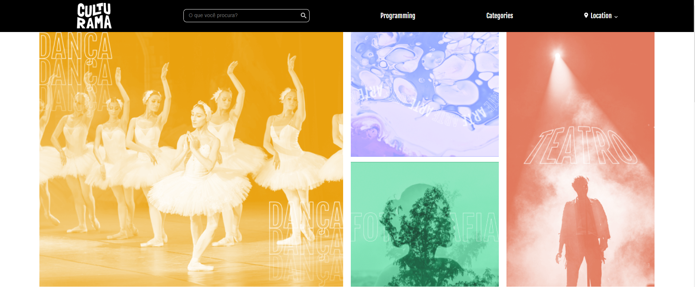

<p align="center">
  
  
  
</p>
<p align="center">
    
</p>

# Culturama

Welcome to the Local Culture Events website, a comprehensive platform designed to showcase and promote cultural events in your community. This project focuses on providing a seamless and engaging user experience, with a particular emphasis on responsiveness to ensure accessibility across all devices.

## Project Overview

The Local Culture Events website serves as a central hub for discovering, promoting, and engaging with cultural events in your area. From festivals and concerts to art exhibitions and traditional celebrations, this platform connects users with the rich cultural tapestry of their local community.

## Features

- **Event Listings:** Browse through a curated list of upcoming cultural events with detailed descriptions, dates, and locations.
- **Responsive Design:** Ensures an optimal viewing experience on desktops, tablets, and mobile devices.
- **User-Friendly Interface:** Intuitive navigation and clean design make it easy for users to find and explore events.
- **Search and Filter:** Quickly search for specific events or filter listings by date, category, or location.
- **Event Submission:** Allows users to submit their own events for inclusion on the site, fostering community engagement.

## Technical Details

- **Languages Used:** HTML, CSS, JavaScript
- **Frameworks and Libraries:** Utilizes modern frameworks and libraries for enhanced functionality and user experience.
- **Responsive Layout:** Employs flexible grid systems and media queries to ensure the site looks great on all screen sizes.
- **Interactive Elements:** JavaScript-powered components for dynamic content updates and user interactions.

## How to Use

1. **Browse Events:**
   - Navigate through the homepage to see a list of featured events.
   - Use the search bar or filters to find specific events based on your interests.

2. **View Event Details:**
   - Click on any event to view more details, including a description, date, time, and location.

3. **Submit an Event:**
   - Use the event submission form to add your own cultural event to the site. Provide all necessary details for review and approval.

## Learning Experience

Developing the Local Culture Events website was an enriching experience that enhanced my skills in responsive web design and user experience optimization. Key learnings include:

- **Responsive Web Design:** Implementing media queries and flexible layouts to ensure the site is accessible on all devices.
- **User Interaction:** Creating intuitive navigation and interactive elements to enhance user engagement.
- **Community Engagement:** Building features that allow user-generated content to promote local events.

## Future Enhancements

- **Advanced Filtering:** Adding more advanced filtering options to help users find events more efficiently.
- **User Accounts:** Implementing user accounts for personalized event recommendations and bookmarking.
- **Integration with Social Media:** Enabling social media sharing to promote events more widely.


## Try It Out

To try out the Simple Calculator locally, follow these steps:

1. **Clone the Repository:**
   ```bash
   git clone https://github.com/yourusername/culturama-alura.git
   cd culturama-alura
   open index.html
